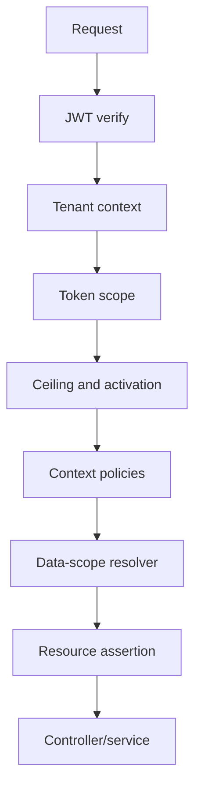
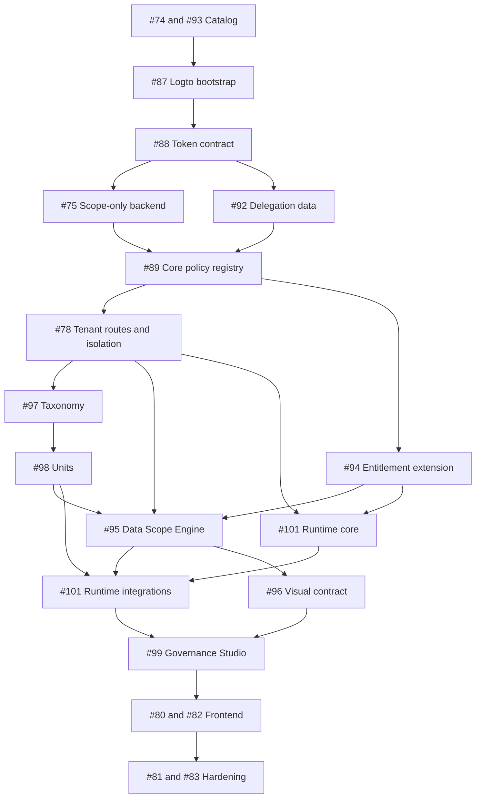

# Civitas Phase 2 — Diseño de Ingeniería de Autorización, Data Scope y Sistema Visual

**Estado:** especificación técnica previa a implementación  
**Versión:** 1.0 — 2026-07-12  
**Repositorio:** [lssmanager/civitas10](https://github.com/lssmanager/civitas10)  
**Epic rector:** [#84](https://github.com/lssmanager/civitas10/issues/84)  
**Issues contractuales:** [#74](https://github.com/lssmanager/civitas10/issues/74), [#87](https://github.com/lssmanager/civitas10/issues/87), [#88](https://github.com/lssmanager/civitas10/issues/88), [#89](https://github.com/lssmanager/civitas10/issues/89), [#92](https://github.com/lssmanager/civitas10/issues/92), [#94](https://github.com/lssmanager/civitas10/issues/94), [#95](https://github.com/lssmanager/civitas10/issues/95), [#96](https://github.com/lssmanager/civitas10/issues/96), [#97](https://github.com/lssmanager/civitas10/issues/97), [#98](https://github.com/lssmanager/civitas10/issues/98) y [#99](https://github.com/lssmanager/civitas10/issues/99).

---

## 1. Propósito y carácter normativo

Este documento define **cómo se debe construir** la autorización de Civitas Phase 2. No es un estudio de factibilidad, una colección de opciones ni una aproximación conceptual. Es una especificación de ingeniería que fija:

- autoridades y límites de confianza;
- vocabulario canónico de roles, permisos y acciones;
- configuración de Logto y contratos de tokens;
- algoritmo de autorización efectivo;
- modelo de datos PostgreSQL/Drizzle;
- caché e invalidación mediante Redis;
- trabajos asíncronos con BullMQ;
- APIs owner y tenant-scoped;
- contrato de pantallas, rutas, acciones y navegación;
- procedimiento obligatorio para incorporar una funcionalidad nueva;
- pruebas, observabilidad, migración y criterios de salida.

Los términos **DEBE**, **NO DEBE**, **DEBERÍA** y **PUEDE** se usan en sentido normativo.

### 1.1 Resultado de arquitectura

Civitas usará una combinación explícita de:

1. **RBAC de Logto** para identidad, membresía, roles y scopes máximos.
2. **Organization Entitlement Overlay de Civitas** para limitar por organización y por rol lo que Logto permite potencialmente.
3. **Policies contextuales** para tenant isolation, delegación, pertenencia y prevención de escalación.
4. **Data Scope Engine** para limitar filas y recursos por sección, asignatura, grupo, relación o identidad.
5. **Visual Access Contract** para representar —nunca conceder— la autorización efectiva.

La ecuación rectora es:

```text
effective action =
  valid token
  ∩ canonical token scope
  ∩ organization ceiling
  ∩ organization activation
  ∩ contextual policies
  ∩ required data scope
  ∩ resource ownership
```

La visibilidad visual se calcula después:

```text
visual eligibility =
  effective action
  ∩ feature flag
  ∩ allowed visual preference
```

Una capa posterior solo puede **mantener o restringir**. Nunca puede recuperar un acceso negado por una capa anterior.

---

## 2. Estado verificado del sistema actual

La ingeniería de Phase 2 debe partir del código real ya fusionado, especialmente del baseline de [PR #50](https://github.com/lssmanager/civitas10/pull/50) y [#17](https://github.com/lssmanager/civitas10/issues/17).

### 2.1 Componentes que ya existen y se reutilizan

| Área | Evidencia actual | Decisión |
|---|---|---|
| API resource | `https://civitas.didaxus.com/api` en [`civitas-shared.contract.cjs`](https://github.com/lssmanager/civitas10/blob/main/core/shared/civitas-shared.contract.cjs) | Conservar como resource indicator canónico. |
| JWT | [`backend/middleware/auth.js`](https://github.com/lssmanager/civitas10/blob/main/backend/middleware/auth.js) usa `jose`, JWKS remoto, issuer y audience | Reutilizar; endurecer contrato y separar global/organization. |
| Tenant isolation | El middleware compara `req.params.organization_id` con el contexto verificado | Conservar como invariant obligatorio en todas las rutas `/o/:organization_id/*`. |
| PostgreSQL/Drizzle | `drizzle-orm`, `drizzle-kit`, `pg`; schema en [`backend/db/schema/index.js`](https://github.com/lssmanager/civitas10/blob/main/backend/db/schema/index.js) | Extender con módulos de schema; no seguir ampliando indefinidamente un solo archivo. |
| Auditoría | Tabla `audit_logs` | Reutilizar y ampliar metadata/versiones; no crear un log paralelo. |
| Operaciones | `operational_operations`, steps e idempotency records | Reutilizar para cambios asíncronos y reconciliación. |
| Redis/BullMQ | `bullmq`, `ioredis`; worker real y health checks | Reutilizar para invalidación, drift y recomputaciones. |
| Colas | `priority_commands` y `background_events` | Mantener; clasificar nuevos jobs en estas colas antes de crear otra. |
| Capability-first | registry de capabilities, adapters, connectors y bindings | Conservar; permisos nunca mencionan Moodle, Stripe u otro adapter concreto. |

### 2.2 Elementos actuales que deben refactorizarse

| Hallazgo | Riesgo | Acción Phase 2 |
|---|---|---|
| `ROLE_PERMISSIONS` local en `backend/authorization/roles.js` | Dos fuentes de verdad; wildcard `owner_global: ['*']` | Retirar mediante #75 después del bootstrap y token contract. |
| `requirePermission.js` consulta roles locales | Una asignación de Logto puede no coincidir con el mapa local | Sustituir por scope verificado + policy/effective-context. |
| Scopes legacy `owner-colon-read`, `owner-colon-write`, `organization-colon-read`, etc. | Nombres ambiguos y fuera de #74/#93 | Migrar con compatibilidad instrumentada; no corte ciego. |
| `rbacMatrix.ts` y `ownerScopes.ts` | Frontend basado en roles/scopes legacy y rutas fijas | Eliminar y sustituir por action registry + authorization context. |
| `routes.ts` y `AppShell.tsx` estáticos | Duplicación y navegación construida por área/rol | Registry modular; rutas estables y navegación filtrada. |
| Schema Drizzle monolítico | Archivo interminable y alta colisión de cambios | Separar por bounded context y agregar barrel de exportación. |

### 2.4 Aclaración sobre el supuesto seed

La revisión de `main` no encontró `scripts/seed-logto-roles.ts` ni `ROLE_SCOPES_MAP`. Los bloques compartidos externamente con esos nombres son propuestas, no código ejecutable del repositorio. No obstante, cualquier propuesta que:

- asigne `org.audit.logs.read` o `analytics.reports.read` a `owner_global`;
- asigne `org.impersonate`;
- active `billing.seats.request_modify`;

contradice esta especificación y debe ser rechazada por el validador de #87 antes de la primera llamada mutante a Logto.

### 2.3 Lo que no se reconstruye

No se recrean organizaciones, registry de connectors, operational state, idempotencia, audit log ni queue backbone. Phase 2 añade autorización sobre esos componentes.

---

## 3. Hallazgos oficiales de Logto y consecuencias de ingeniería

Esta sección incorpora el contenido técnico de la documentación oficial y lo transforma en requisitos concretos para Civitas.

### 3.1 Autorización token-based y tipos de scope

La documentación de [Authorization de Logto](https://docs.logto.io/authorization) establece que la autorización define qué APIs, recursos o acciones puede usar una identidad después de autenticarse. Logto modela:

- un **API resource** como backend o servicio protegido;
- un **role** como colección de permisos;
- un **permission/scope** como acción específica;
- una **organization** como tenant/workspace del producto, distinta del tenant de Logto;
- un **organization template** como conjunto reutilizable de roles y permisos para todas las organizaciones;
- access tokens y organization tokens como portadores de claims.

Logto distingue tres escenarios: recursos globales, permisos organizacionales no API y recursos API con contexto organizacional. Civitas utiliza dos superficies:

- `/owner/*`: token global con permisos `owner dot wildcard` y sin `organization_id`;
- `/o/:organization_id/*`: organization-level API token con scopes de negocio y `organization_id`.

**Consecuencia:** un path `/owner/...` no vuelve global un token organizacional, y un rol `owner_global` no debe usarse como sustituto de audience/scope.

### 3.2 API resource, audience y RFC 8707

La guía [RBAC de Logto](https://docs.logto.io/authorization/role-based-access-control) indica que cada API resource tiene un identificador URI único y que Logto sigue [RFC 8707](https://www.rfc-editor.org/rfc/rfc8707.html). RFC 8707 permite al cliente declarar explícitamente el protected resource para el cual solicita un token; ese resource se refleja en la restricción de audience.

En Civitas:

```text
resource = https://civitas.didaxus.com/api
expected aud = https://civitas.didaxus.com/api
```

El backend DEBE verificar firma, `iss`, `aud`, `exp` y tipo/contexto del token. No es suficiente decodificar el JWT ni comprobar un rol.

Logto advierte que, si no se especifica resource/organization, puede emitir un token opaco destinado a `userinfo`. Por ello todos los clientes Civitas que invocan la API deben pedir el resource canónico.

### 3.3 Organization template: uniforme, no personalizado por tenant

La documentación de [Organization template](https://docs.logto.io/authorization/organization-template) afirma que todas las organizaciones heredan el mismo blueprint de roles, permisos y matriz role-permission. También aclara que los usuarios pueden tener roles distintos en cada organización, pero el catálogo disponible es compartido.

**Consecuencia crítica:** Logto no es el lugar para crear `organization_math_teacher` en una organización o para modificar el rol `organization_headdirector` de manera diferente en X e Y. La variación por organización se implementa en Civitas mediante ceilings, activaciones y data scope.

Tampoco se deben transformar `mathematics`, `primary`, `campus-a` o `billing-team` en scopes. Son valores de dominio, no acciones.

### 3.4 Organization-level API token

La guía [Protect organization-level API resources](https://docs.logto.io/authorization/organization-level-api-resources) especifica:

- al pedir token con `resource` y `organization_id`, Logto evalúa roles de esa organización;
- el JWT contiene `aud`, `organization_id` y scopes filtrados por los organization roles;
- el API debe validar que el `organization_id` del token coincide con el path;
- para obtener refresh token se solicita `offline_access`;
- se solicita además `urn:logto:scope:organizations` para experiencia organizacional;
- actualmente la obtención del organization token se realiza desde refresh-token flow, incluyendo `resource` y `organization_id`.

Solicitud lógica de Civitas:

```text
scope = openid profile email offline_access urn:logto:scope:organizations <exact scopes>
resource = https://civitas.didaxus.com/api
organization_id = <selected Logto organization ID>
```

El frontend no arma manualmente llamadas inseguras al token endpoint si el SDK de Logto ofrece la operación. Debe seguir las convenciones del SDK y mantener PKCE/session handling.

### 3.5 Scope changes y tokens stale

La guía [Handle scope updates in organization tokens](https://docs.logto.io/end-user-flows/organization-experience/permission-and-resource-management) explica:

- un JWT emitido no se modifica cuando cambian permisos;
- para revocar o conceder un scope ya conocido, se limpia el token cacheado y se obtiene uno nuevo mediante refresh token;
- si se introduce un scope nuevo que no estaba consentido, puede requerirse nuevo login/consent;
- Logto ofrece Management API para consultar scopes reales, pero esa consulta es una herramienta de sincronización/diagnóstico, no una obligación por request.

**Decisión Civitas:**

- access-token TTL objetivo: **15 minutos** si la configuración operativa de Logto lo permite; máximo aceptado inicial: 60 minutos, documentado como riesgo;
- silent refresh con `offline_access`;
- cambios Civitas de ceiling/activation/data scope surten efecto en la siguiente request porque viven fuera del JWT;
- cambios de roles/scopes Logto disparan invalidación del token cliente o re-consent según el caso;
- no se llama a Management API en cada request.

### 3.6 Custom token claims: uso mínimo

[Custom access token](https://docs.logto.io/developers/custom-token-claims) permite añadir claims a JWT u opaque tokens. La función oficial `getCustomJwtClaims({ token, context, environmentVariables })` puede usar datos del token/contexto y, técnicamente, hacer `fetch` externo. Logto advierte que las llamadas externas agregan latencia y deben manejar timeout/error.

Logto presenta custom claims como apoyo para ABAC. Eso no significa que deba copiarse todo el grafo de autorización al token.

Civitas PUEDE emitir claims namespaced pequeños y estables:

```json
{
  "https://civitas.didaxus.com/claims/authz_contract_version": "2026-07-v1",
  "https://civitas.didaxus.com/claims/organization_role_ids": ["role-id-1"]
}
```

No se incluyen:

- listas de estudiantes;
- subjects/sections asignados;
- ceilings o activaciones;
- grafo de unidades/grupos;
- secretos de connectors;
- permisos efectivos duplicados;
- PII académica.

El custom claim script no debe depender de Civitas DB para cada token salvo necesidad demostrada y SLO definido. Un fallo de Civitas no debe bloquear masivamente el login por una optimización evitable.

### 3.7 Management API y M2M

La guía RBAC de Logto establece que roles M2M globales pueden vincularse a Management API, mientras que roles M2M organizacionales son organization-specific y no se usan para administrar Logto globalmente.

Por tanto:

- el bootstrap/drift checker usa una aplicación M2M backend con scopes mínimos de Management API;
- secretos M2M permanecen en backend/secret store;
- el navegador nunca llama directamente a Management API;
- tenant admin no modifica el organization template ni crea scopes/roles;
- el backend solo ejecuta mutaciones Logto permitidas, principalmente membership y role assignment bajo #92/#89.

### 3.8 Estándares complementarios

- [RFC 8725 — JWT Best Current Practices](https://www.rfc-editor.org/rfc/rfc8725.html) exige validación estricta y evitar confusión de algoritmos/tipos. Civitas fija algoritmos aceptados por la librería y valida issuer/audience por tipo de token.
- [RFC 9700 — OAuth 2.0 Security BCP](https://www.rfc-editor.org/rfc/rfc9700.html) actualiza prácticas de seguridad OAuth. Civitas usa authorization code + PKCE para clientes públicos y no expone client secrets en frontend.
- [RFC 8707](https://www.rfc-editor.org/rfc/rfc8707.html) justifica el resource indicator canónico y audience validation.

---

## 4. Autoridades y límites de confianza

| Capa | Fuente canónica | Puede | No puede |
|---|---|---|---|
| Logto | Identidad, membership, role assignment, API resource, scopes | Emitir máximo RBAC en token | Expresar sección/materia o ceiling distinto por org sobre un template común |
| Civitas policy | Backend | Restringir por tenant, delegación, recurso y contexto | Inventar un scope ausente del token |
| Entitlement overlay | PostgreSQL | Owner limita; tenant activa dentro del límite | Ampliar más allá del token o ceiling |
| Taxonomía | PostgreSQL | Definir subjects, sections, campuses, departments | Conceder permisos |
| Units/groups | PostgreSQL | Agrupar personas/recursos y derivar audiencias | Actuar como rol implícito |
| Data scope | PostgreSQL + adapters | Filtrar filas y recursos | Sustituir el permiso de acción |
| Feature flags | Config/DB según #91 | Apagar una capacidad | Autorizarla |
| UI preferences | PostgreSQL | Ocultar/reordenar elementos opcionales | Proteger ruta/API o mostrar algo no autorizado |
| Frontend | Authorization context | Representar la decisión | Ser autoridad de seguridad |
| Redis | Caché/transporte | Acelerar y propagar invalidación | Convertirse en única persistencia de autorización |

### 4.1 Invariantes no negociables

1. Roles tenant conservan prefijo `organization_*`; permisos tenant usan `org dot wildcard` cuando pertenecen al core organizacional.
2. `organization dot wildcard` está deprecated; no se mezcla con `org dot wildcard`.
3. No se persisten wildcards como `lms dot wildcard` o `org.members dot wildcard`.
4. `owner_global` recibe solo permisos globales `owner dot wildcard`.
5. Roles organizacionales nunca reciben `owner dot wildcard`.
6. Un grupo no concede permisos.
7. Un rol no implica automáticamente data scope.
8. Un data scope no crea un rol.
9. Una preferencia visual solo resta.
10. Ningún adapter/provider aparece en un permiso canónico.

---

## 5. Modelo canónico de permisos y acciones

### 5.1 Naming

Formato:

```text
<domain>.<resource>.<action>
```

Ejemplos válidos:

```text
owner.organizations.read
owner.organizations.manage
org.members.read
org.members.roles.assign
lms.grades.read
lms.grades.manage
billing.invoices.read
connectors.configure
```

Ejemplos inválidos:

```text
read                         # sin dominio/recurso
owner-colon-write                  # legacy ambiguo
org.impersonate              # operación sin recurso/acción clara
lms dot wildcard                        # wildcard
lms.math.grades.manage       # taxonomía mezclada con permiso
organization_math_teacher    # taxonomía mezclada con rol
```

### 5.2 Catálogo modular

El catálogo no debe ser un array interminable. Estructura propuesta:

```text
core/authz/catalog/
├── owner.permissions.js
├── organization.permissions.js
├── lms.permissions.js
├── billing.permissions.js
├── connectors.permissions.js
├── support.permissions.js
├── scheduling.permissions.js
├── analytics.permissions.js
├── crm.permissions.js
├── marketing.permissions.js
├── community.permissions.js
├── notifications.permissions.js
├── communications.permissions.js
├── registry.js
└── contract-tests/
```

Cada dominio conserva un archivo propio. No se agrupan permisos distintos en un módulo genérico `engagement.permissions.js`, porque CRM, marketing, community, notifications y communications tienen consumidores, ciclos de vida y ownership diferentes. El registry puede ofrecer agrupaciones de presentación sin cambiar el ownership del catálogo.

Cada permiso declara:

```ts
type PermissionDefinition = {
  name: string;
  description: string;
  domain: string;
  surface: 'global' | 'organization' | 'self';
  status: 'active' | 'planned' | 'deprecated';
  resource: 'https://civitas.didaxus.com/api';
  consumers: string[];
  policyRequirements: string[];
  dataScopeStrategy?: string;
  screenActionIds?: string[];
  overlayMode: 'not-applicable' | 'restrictable';
  replacement?: string;
};
```

Un permiso `planned` no se provisiona ni asigna. Todo permiso `active` debe tener consumidor o excepción documentada.

### 5.3 Acción visual vs scope

Los componentes consumen action IDs estables:

```text
actionId: grades.update
required permission: lms.grades.manage
policies: same-organization, resource-in-data-scope
```

Esto permite cambiar metadatos/policies centralmente sin repetir strings de scopes en cada botón.

---

## 6. Roles, ceilings, activaciones y permiso efectivo

### 6.1 Roles

Los roles canónicos permanecen compartidos:

```text
owner_global
organization_admin
organization_director
organization_headdirector
organization_headteacher
organization_teacher
organization_student
organization_parent
organization_secretary
organization_accountant
organization_billing
organization_payroll
organization_member
```

`organization_headdirector` no significa primaria o bachillerato. Esa diferencia vive en `authorization_scope_assignments`.

### 6.2 Tres niveles de permiso

| Nivel | Ejemplo | Dueño |
|---|---|---|
| Role potential | El rol puede soportar `lms.grades.manage` | Catálogo/Logto |
| Owner ceiling | En org X el rol puede recibirlo; en org Y no | Owner/Civitas |
| Tenant activation | Admin X lo activa dentro del ceiling | Tenant/Civitas |

El permiso efectivo para un role path es:

```text
token scope ∩ owner ceiling ∩ tenant activation ∩ contextual policy
```

### 6.3 Múltiples roles

La unión se hace por **paths autorizados completos**. No se permite tomar el permiso de un rol y el data scope de otro rol no relacionado.

```text
for each assigned role:
  if role supplies permission
     and ceiling allows
     and activation enables
     and policies pass
     and role-linked data assignment covers resource:
       path = ALLOW

final = ALLOW if at least one complete path allows
```

La explicación conserva `roleId`, permission, ceiling version, activation version y data-scope provenance.

### 6.4 Deny codes

```text
token_invalid
audience_mismatch
organization_context_missing
organization_route_mismatch
permission_missing
owner_ceiling_denied
tenant_activation_disabled
policy_denied
data_scope_assignment_missing
resource_out_of_scope
feature_disabled
navigation_hidden
```

El API devuelve 401 para token ausente/inválido/expirado; 403 para identidad válida sin autorización. Para un `GET /resource/:id` fuera de data scope puede devolverse un 404 neutro (`RESOURCE_NOT_FOUND_OR_NOT_ACCESSIBLE`) para reducir enumeración, siempre de forma consistente.

---

## 7. Contrato de tokens Logto

### 7.1 Tipos de token

| Token | Uso | Claims/validaciones mínimas |
|---|---|---|
| User global API token | `/owner/*` | firma, `iss`, `aud`, `exp`, `sub`, `scope`; ausencia de `organization_id` |
| User organization API token | `/o/:organization_id/*` | firma, `iss`, `aud`, `exp`, `sub`, `scope`, `organization_id`; match con path |
| M2M Management token | bootstrap/drift y mutaciones Logto autorizadas | client credentials, audience Management API, mínimos scopes |
| M2M organization token | automatización sobre una org cuando aplique | `resource`, `organization_id`, exact scopes; nunca privilegio global implícito |
| Internal worker identity | ejecutar jobs Civitas | identidad de servicio interna; no reutiliza bearer token del usuario |

### 7.2 Validación backend

Pipeline obligatorio:

```text
Authorization: Bearer
→ verify signature against cached JWKS
→ allowlisted algorithm
→ exact issuer
→ exact audience
→ expiration/not-before
→ token surface global vs organization
→ organization_id/path equality
→ exact scope
→ effective authorization layers
```

No se autoriza usando payload decodificado antes de verificar firma. Puede decodificarse únicamente para seleccionar una estrategia de validación sin confiar en sus valores.

### 7.3 Refresh e invalidación

- Pedir `offline_access` y `urn:logto:scope:organizations`.
- Mantener access tokens cortos.
- Cuando cambie membership/role en Logto, emitir evento `authz.logto_membership_changed`.
- El cliente limpia organization token cache y obtiene uno nuevo.
- Si el scope es nuevo para el consentimiento existente, iniciar re-consent.
- El authorization context de Civitas usa `policyVersion`; un cambio de overlay invalida inmediatamente su caché aunque el JWT siga vigente.

### 7.4 Claims prohibidos

No guardar en token: assignments completos, listas de alumnos, relación parent-child completa, navegación personalizada, secrets, downstream credentials o objetos de connector.

---

## 8. Esquema PostgreSQL/Drizzle

### 8.1 Organización de archivos

El schema actual está en un solo `index.js`. Phase 2 debe modularizarlo sin cambiar el stack CommonJS vigente:

```text
backend/db/schema/
├── base.js
├── identity.js
├── operations.js
├── registry.js
├── authz-entitlements.js
├── authz-delegation.js
├── authz-taxonomy.js
├── authz-units.js
├── authz-data-scopes.js
├── authz-visual.js
├── authz-outbox.js
├── audit.js
└── index.js
```

`index.js` solo reexporta módulos. Las migraciones se generan con `drizzle-kit generate`, se revisan y se aplican con `drizzle-kit migrate`. No usar `db:push` en producción.

La documentación oficial de [Drizzle indexes and constraints](https://orm.drizzle.team/docs/indexes-constraints) enfatiza que constraints protegen exactitud e integridad. Los invariantes de autorización deben existir en DB cuando sean expresables, no solo en UI.

### 8.2 Entitlement limits

```js
const organizationRoleEntitlementLimits = pgTable('organization_role_entitlement_limits', {
  id: uuid('id').primaryKey().defaultRandom(),
  logtoOrganizationId: varchar('logto_organization_id', { length: 128 }).notNull(),
  logtoRoleId: varchar('logto_role_id', { length: 128 }).notNull(),
  permission: varchar('permission', { length: 180 }).notNull(),
  allowed: boolean('allowed').notNull().default(false),
  locked: boolean('locked').notNull().default(false),
  contractVersion: varchar('contract_version', { length: 80 }).notNull(),
  updatedByLogtoUserId: varchar('updated_by_logto_user_id', { length: 128 }).notNull(),
  ...timestamps,
}, (t) => ({
  uniq: uniqueIndex('org_role_entitlement_limit_uidx')
    .on(t.logtoOrganizationId, t.logtoRoleId, t.permission),
  orgRoleIdx: index('org_role_entitlement_limit_org_role_idx')
    .on(t.logtoOrganizationId, t.logtoRoleId),
}));
```

`permission` se valida contra catálogo activo en service layer y CI. No acepta wildcard.

### 8.3 Tenant activations

```js
const organizationRolePermissionActivations = pgTable('organization_role_permission_activations', {
  id: uuid('id').primaryKey().defaultRandom(),
  logtoOrganizationId: varchar('logto_organization_id', { length: 128 }).notNull(),
  logtoRoleId: varchar('logto_role_id', { length: 128 }).notNull(),
  permission: varchar('permission', { length: 180 }).notNull(),
  enabled: boolean('enabled').notNull().default(false),
  entitlementLimitId: uuid('entitlement_limit_id').notNull()
    .references(() => organizationRoleEntitlementLimits.id, { onDelete: 'cascade' }),
  policyVersion: varchar('policy_version', { length: 80 }).notNull(),
  updatedByLogtoUserId: varchar('updated_by_logto_user_id', { length: 128 }).notNull(),
  ...timestamps,
}, (t) => ({
  uniq: uniqueIndex('org_role_permission_activation_uidx')
    .on(t.logtoOrganizationId, t.logtoRoleId, t.permission),
}));
```

Un trigger o transacción de servicio debe impedir `enabled=true` cuando `allowed=false`. La validación UI no basta.

### 8.4 Delegation limits

```js
const organizationRoleDelegationRules = pgTable('organization_role_delegation_rules', {
  id: uuid('id').primaryKey().defaultRandom(),
  logtoOrganizationId: varchar('logto_organization_id', { length: 128 }).notNull(),
  actorRoleId: varchar('actor_role_id', { length: 128 }).notNull(),
  targetRoleId: varchar('target_role_id', { length: 128 }).notNull(),
  canAssign: boolean('can_assign').notNull().default(false),
  canRevoke: boolean('can_revoke').notNull().default(false),
  ownerLocked: boolean('owner_locked').notNull().default(true),
  ...timestamps,
}, (t) => ({
  uniq: uniqueIndex('org_role_delegation_rule_uidx')
    .on(t.logtoOrganizationId, t.actorRoleId, t.targetRoleId),
}));
```

Estas reglas soportan #92 y la policy `target-role-delegable`. La API además verifica `cannot-escalate-privileges`.

### 8.5 Taxonomía parametrizable

```js
const organizationDimensionDefinitions = pgTable('organization_dimension_definitions', {
  id: uuid('id').primaryKey().defaultRandom(),
  logtoOrganizationId: varchar('logto_organization_id', { length: 128 }).notNull(),
  dimensionKey: varchar('dimension_key', { length: 100 }).notNull(),
  label: varchar('label', { length: 160 }).notNull(),
  hierarchyEnabled: boolean('hierarchy_enabled').notNull().default(false),
  status: varchar('status', { length: 32 }).notNull().default('draft'),
  version: integer('version').notNull().default(1),
  ...timestamps,
}, (t) => ({
  uniq: uniqueIndex('org_dimension_definition_uidx')
    .on(t.logtoOrganizationId, t.dimensionKey),
}));

const organizationDimensionValues = pgTable('organization_dimension_values', {
  id: uuid('id').primaryKey().defaultRandom(),
  definitionId: uuid('definition_id').notNull()
    .references(() => organizationDimensionDefinitions.id, { onDelete: 'cascade' }),
  logtoOrganizationId: varchar('logto_organization_id', { length: 128 }).notNull(),
  stableKey: varchar('stable_key', { length: 120 }).notNull(),
  label: varchar('label', { length: 180 }).notNull(),
  parentValueId: uuid('parent_value_id'),
  status: varchar('status', { length: 32 }).notNull().default('active'),
  sortOrder: integer('sort_order').notNull().default(0),
  metadata: jsonb('metadata').notNull().default(sql`'{}'::jsonb`),
  ...timestamps,
}, (t) => ({
  uniq: uniqueIndex('org_dimension_value_uidx')
    .on(t.logtoOrganizationId, t.definitionId, t.stableKey),
  parentIdx: index('org_dimension_value_parent_idx').on(t.parentValueId),
}));
```

Dimensiones iniciales:

```text
academic.section
academic.subject
academic.grade_level
organization.campus
organization.department
administration.function
```

`primary` y `mathematics` son values con UUID estable. Cambiar label no cambia identidad. Archivar impide asignaciones nuevas sin borrar historial.

La prevención de ciclos se ejecuta en una transacción:

1. adquirir advisory transaction lock por `organization_id + dimension_key`;
2. verificar misma organización/dimensión;
3. rechazar self-parent;
4. recorrer ancestros desde el parent candidato;
5. rechazar si aparece el child;
6. actualizar versión y emitir outbox event.

```sql
WITH RECURSIVE ancestors AS (
  SELECT id, parent_value_id
  FROM organization_dimension_values
  WHERE id = $candidate_parent_id
    AND logto_organization_id = $organization_id
    AND dimension_key = $dimension_key

  UNION ALL

  SELECT p.id, p.parent_value_id
  FROM organization_dimension_values p
  JOIN ancestors a ON p.id = a.parent_value_id
  WHERE p.logto_organization_id = $organization_id
    AND p.dimension_key = $dimension_key
)
SELECT 1 FROM ancestors WHERE id = $child_id LIMIT 1;
```

Un trigger/constraint trigger equivalente actúa como defensa en profundidad, o los writes quedan restringidos exclusivamente al servicio que ejecuta este algoritmo.

### 8.6 Units y memberships

```js
const organizationUnits = pgTable('organization_units', {
  id: uuid('id').primaryKey().defaultRandom(),
  logtoOrganizationId: varchar('logto_organization_id', { length: 128 }).notNull(),
  unitType: varchar('unit_type', { length: 80 }).notNull(),
  stableKey: varchar('stable_key', { length: 120 }).notNull(),
  name: varchar('name', { length: 180 }).notNull(),
  parentUnitId: uuid('parent_unit_id'),
  dimensionValueId: uuid('dimension_value_id')
    .references(() => organizationDimensionValues.id, { onDelete: 'restrict' }),
  status: varchar('status', { length: 32 }).notNull().default('active'),
  metadata: jsonb('metadata').notNull().default(sql`'{}'::jsonb`),
  ...timestamps,
}, (t) => ({
  uniq: uniqueIndex('organization_unit_uidx')
    .on(t.logtoOrganizationId, t.unitType, t.stableKey),
}));

const organizationUnitMemberships = pgTable('organization_unit_memberships', {
  id: uuid('id').primaryKey().defaultRandom(),
  logtoOrganizationId: varchar('logto_organization_id', { length: 128 }).notNull(),
  unitId: uuid('unit_id').notNull()
    .references(() => organizationUnits.id, { onDelete: 'cascade' }),
  memberType: varchar('member_type', { length: 32 }).notNull(),
  memberRef: varchar('member_ref', { length: 160 }).notNull(),
  relationship: varchar('relationship', { length: 80 }).notNull(),
  validFrom: timestamp('valid_from', { withTimezone: true }).defaultNow(),
  validUntil: timestamp('valid_until', { withTimezone: true }),
  metadata: jsonb('metadata').notNull().default(sql`'{}'::jsonb`),
  ...timestamps,
}, (t) => ({
  lookupIdx: index('organization_unit_membership_lookup_idx')
    .on(t.logtoOrganizationId, t.memberType, t.memberRef),
}));
```

Ejemplos de `relationship`: `leads`, `teaches`, `studies_in`, `supports`, `belongs_to`. Ninguna relación agrega scopes.

El reparent de units usa el mismo patrón anti-ciclos, con advisory lock por organización/hierarchy y CTE recursivo sobre `parent_unit_id`. Debe rechazar self-parent, cross-tenant, hierarchy incompatible y ciclos bajo dos reparents concurrentes.

### 8.7 Data-scope assignments

```js
const authorizationScopeAssignments = pgTable('authorization_scope_assignments', {
  id: uuid('id').primaryKey().defaultRandom(),
  logtoOrganizationId: varchar('logto_organization_id', { length: 128 }).notNull(),
  logtoUserId: varchar('logto_user_id', { length: 128 }).notNull(),
  logtoRoleId: varchar('logto_role_id', { length: 128 }).notNull(),
  capability: varchar('capability', { length: 80 }).notNull(),
  dimensionKey: varchar('dimension_key', { length: 100 }).notNull(),
  dimensionValueId: uuid('dimension_value_id')
    .references(() => organizationDimensionValues.id, { onDelete: 'restrict' }),
  unitId: uuid('unit_id')
    .references(() => organizationUnits.id, { onDelete: 'restrict' }),
  resourceRef: varchar('resource_ref', { length: 180 }),
  assignedByLogtoUserId: varchar('assigned_by_logto_user_id', { length: 128 }).notNull(),
  validFrom: timestamp('valid_from', { withTimezone: true }).notNull().defaultNow(),
  validUntil: timestamp('valid_until', { withTimezone: true }),
  ...timestamps,
}, (t) => ({
  subjectIdx: index('authz_scope_assignment_subject_idx')
    .on(t.logtoOrganizationId, t.logtoUserId, t.logtoRoleId, t.capability),
}));
```

Debe existir exactamente una referencia objetivo válida según la estrategia: dimension value, unit o resource ref. La primera migración incluye el CHECK PostgreSQL, aunque se escriba mediante SQL custom generado junto a Drizzle:

```sql
ALTER TABLE authorization_scope_assignments
ADD CONSTRAINT authorization_scope_assignments_exactly_one_target_ck
CHECK (
  num_nonnulls(dimension_value_id, unit_id, resource_ref) = 1
);
```

La service layer valida además que dimension value/unit pertenezca a la misma organización y que el resource ref sea reconocido por su capability adapter. Los tests intentan 0, 1, 2 y 3 referencias no-null; solo una debe pasar.

Composición:

```text
OR entre valores de la misma dimensión
AND entre dimensiones diferentes
```

### 8.8 Aliases y navegación

```js
const organizationRoleAliases = pgTable('organization_role_aliases', {
  id: uuid('id').primaryKey().defaultRandom(),
  logtoOrganizationId: varchar('logto_organization_id', { length: 128 }).notNull(),
  logtoRoleId: varchar('logto_role_id', { length: 128 }).notNull(),
  visualAlias: varchar('visual_alias', { length: 160 }).notNull(),
  updatedByLogtoUserId: varchar('updated_by_logto_user_id', { length: 128 }).notNull(),
  ...timestamps,
}, (t) => ({
  uniq: uniqueIndex('organization_role_alias_uidx')
    .on(t.logtoOrganizationId, t.logtoRoleId),
}));

const organizationUiPreferences = pgTable('organization_ui_preferences', {
  id: uuid('id').primaryKey().defaultRandom(),
  logtoOrganizationId: varchar('logto_organization_id', { length: 128 }).notNull(),
  screenId: varchar('screen_id', { length: 140 }).notNull(),
  menuKey: varchar('menu_key', { length: 140 }).notNull(),
  hidden: boolean('hidden').notNull().default(false),
  displayOrder: integer('display_order').notNull().default(0),
  updatedByLogtoUserId: varchar('updated_by_logto_user_id', { length: 128 }).notNull(),
  ...timestamps,
}, (t) => ({
  uniq: uniqueIndex('organization_ui_preference_uidx')
    .on(t.logtoOrganizationId, t.screenId),
}));
```

La API valida `screenId/menuKey` contra el registry publicado. No se guardan routes arbitrarias.

### 8.9 Transactional outbox

Para no perder invalidaciones si PostgreSQL confirma y Redis falla:

```js
const authorizationOutboxEvents = pgTable('authorization_outbox_events', {
  id: uuid('id').primaryKey().defaultRandom(),
  eventType: varchar('event_type', { length: 120 }).notNull(),
  aggregateType: varchar('aggregate_type', { length: 80 }).notNull(),
  aggregateId: varchar('aggregate_id', { length: 180 }).notNull(),
  logtoOrganizationId: varchar('logto_organization_id', { length: 128 }),
  payload: jsonb('payload').notNull().default(sql`'{}'::jsonb`),
  status: varchar('status', { length: 32 }).notNull().default('pending'),
  attempts: integer('attempts').notNull().default(0),
  availableAt: timestamp('available_at', { withTimezone: true }).notNull().defaultNow(),
  publishedAt: timestamp('published_at', { withTimezone: true }),
  ...timestamps,
}, (t) => ({
  pendingIdx: index('authorization_outbox_pending_idx')
    .on(t.status, t.availableAt),
}));
```

La mutación y el outbox event se escriben en una sola transacción.

---

## 9. Redis, caché e invalidación

### 9.1 Principio

Redis acelera decisiones pero no es fuente canónica. Si una entrada no existe, se recompone desde PostgreSQL/Logto context. Si el resolver crítico falla y no puede comprobar seguridad, se aplica **fail closed**.

### 9.2 Keys

```text
civitas:authz:effective:v1:<orgId>:<userId>:<policyVersion>
civitas:authz:data-scope:v1:<orgId>:<userId>:<policyVersion>
civitas:authz:org-config:v1:<orgId>:<configVersion>
civitas:authz:visual:v1:<orgId>:<visualVersion>
civitas:authz:catalog:v1:<catalogVersion>
```

No incluir PII en keys. Los valores no guardan tokens ni secretos.

### 9.3 TTL

| Entrada | TTL recomendado | Invalidación explícita |
|---|---:|---|
| Catálogo canónico | 10 min | catalog publication/drift |
| Org config | 5 min | ceiling/activation/flag change |
| Effective context | 60–120 s | role, activation, assignment change |
| Data scope | 60–120 s | assignment/unit/taxonomy change |
| Visual state | 5 min | alias/navigation update |

Los TTL son red de seguridad; la coherencia primaria viene del versionado y eventos.

### 9.4 Estrategia de invalidación

1. API actualiza DB y outbox en transacción.
2. Worker publica/reconcilia evento.
3. Se incrementa version por organización/subject.
4. Lecturas nuevas cambian de key y dejan obsoleta la anterior.
5. Limpieza eventual elimina keys antiguas por TTL.

Preferir versioned keys sobre búsquedas `KEYS`. La documentación oficial de [Redis keyspace](https://redis.io/docs/latest/develop/using-commands/keyspace/) recomienda no usar `KEYS` en código regular por su costo bloqueante; usar `SCAN` solo para mantenimiento.

Redis [keyspace notifications](https://redis.io/docs/latest/develop/pubsub/keyspace-notifications/) están deshabilitadas por defecto y consumen CPU. No deben ser el mecanismo único de consistencia. El outbox es durable; Pub/Sub puede usarse como acelerador de broadcast.

---

## 10. BullMQ y workers

### 10.1 Baseline existente

El worker actual crea BullMQ `Worker` para `priority_commands` y `background_events`, registra completed/failed/error, usa concurrencia configurable, heartbeat, health de Redis/Postgres y reconciliador de operaciones pendientes cada 30 segundos.

La documentación oficial de [BullMQ Workers](https://docs.bullmq.io/guide/workers) define al worker como receptor que completa el job y mueve fallos a estado failed. [Idempotent jobs](https://docs.bullmq.io/patterns/idempotent-jobs) exige que reintentar no cambie el estado final y recomienda jobs atómicos. [Retrying jobs](https://docs.bullmq.io/guide/retrying-failing-jobs) soporta attempts y backoff.

### 10.2 Jobs Phase 2

| Queue | Job | Propósito |
|---|---|---|
| `priority_commands` | `authz.invalidate-subject` | Invalidar contexto efectivo tras revocación/activación. |
| `priority_commands` | `authz.revoke-role-assignments` | Desactivar data assignments ligados a rol retirado. |
| `priority_commands` | `authz.sync-logto-membership` | Ejecutar mutación Logto aprobada y reconciliar. |
| `background_events` | `authz.publish-outbox` | Publicar invalidaciones durables. |
| `background_events` | `authz.recompute-audience` | Recalcular audiencia derivada de units/groups. |
| `background_events` | `authz.detect-logto-drift` | Comparar #74/#87 con Logto. |
| `background_events` | `authz.archive-taxonomy-value` | Migrar/revocar referencias antes de archive definitivo. |
| `background_events` | `authz.cleanup-cache-versions` | Limpieza no crítica. |

### 10.3 Payload mínimo

```ts
type AuthorizationJobPayload = {
  operationId: string;
  eventId: string;
  organization_id?: string;
  actor: {
    subjectId: string;
    actorType: 'user' | 'service';
  };
  target: {
    type: string;
    id: string;
  };
  authorizationSnapshot: {
    decisionId: string;
    policyVersion: string;
    permission: string;
  };
  requestedAt: string;
};
```

No guardar access token/refresh token en job data, Redis, `operational_operations.input_json` o logs.

### 10.4 Reautorización al ejecutar

La API autoriza la solicitud y registra snapshot. Antes de una mutación sensible, el worker vuelve a comprobar estado actual:

- membership vigente;
- ceiling/activation actuales;
- target sigue en la misma organización;
- data scope no fue revocado;
- operación no fue cancelada.

El worker actúa con identidad de servicio interna y permisos mínimos. Si el usuario perdió acceso antes de ejecutar, el job termina `cancelled_authorization_changed`, no continúa con un token capturado.

### 10.5 Idempotencia

```text
jobId = authz:<eventType>:<aggregateId>:<version>
idempotencyKey = <actor>:<org>:<action>:<target>:<requestedVersion>
```

Cada handler verifica estado final antes de mutar. Retries usan exponential backoff con jitter. Errores permanentes de validación no se reintentan; timeouts/5xx sí, con límite.

---

## 11. Middleware y Authorization Data Scope Engine

### 11.1 Pipeline HTTP



Cada middleware adjunta datos, pero la decisión final debe ser una estructura explicable:

```ts
type AuthorizationDecision = {
  allowed: boolean;
  decisionId: string;
  permission: string;
  actionId?: string;
  organization_id?: string;
  rolePath?: string;
  policyVersion: string;
  reasonCode?: string;
  dataScope?: { strategy: string; summary: string[] };
};
```

### 11.2 Estrategias de data scope

| Strategy | Caso | Comportamiento sin assignment |
|---|---|---|
| `organization` | Director con visión completa | organization, solo si policy explícita |
| `dimensions` | Headdirector por section; headteacher por subject | deny/empty |
| `relationships` | Teacher por assigned groups; parent por related students | deny/empty |
| `self` | Student/self profile | self |
| `resource-list` | Recursos explícitos excepcionales | deny/empty |

El frontend nunca manda `section=primary` como autoridad. Puede mandar filtros de UX, pero el backend los intersecta con el scope autorizado.

### 11.3 Adapters capability-first

```ts
interface CapabilityDataScopeAdapter {
  capability: string;
  applyListScope(context, query): unknown;
  assertResourceScope(context, resourceId): Promise<void>;
  assertMutationScope(context, input): Promise<void>;
  explainScope(context): ScopeExplanation;
}
```

Registry por `lms`, `crm`, `support`, `scheduling`; nunca por Moodle/BuddyBoss/etc.

---

## 12. Contratos API

### 12.1 Authorization context

```http
GET /o/:organization_id/me/authorization-context
```

```json
{
  "subject": "logto-user-id",
  "organization_id": "logto-org-id",
  "tokenPermissions": ["lms.grades.read", "lms.grades.manage"],
  "effectivePermissions": ["lms.grades.read"],
  "effectiveActions": ["grades.view"],
  "roles": [{ "id": "role-id", "name": "organization_headdirector", "alias": "Director de primaria" }],
  "dataScopeSummary": [{ "dimensionKey": "academic.section", "valueIds": ["uuid-primary"] }],
  "versions": {
    "catalog": "2026-07-v1",
    "policy": "42",
    "organizationConfig": "17",
    "visual": "8"
  }
}
```

No devuelve assignments completos ni permite que el navegador decida si un resource ID está cubierto.

### 12.2 Owner governance

```text
GET   /owner/authorization/catalog
GET   /owner/organizations/:organization_id/governance
PATCH /owner/organizations/:organization_id/entitlement-limits
POST  /owner/organizations/:organization_id/access-preview
```

### 12.3 Tenant governance

```text
GET   /o/:organization_id/governance
PATCH /o/:organization_id/role-permission-activations
GET   /o/:organization_id/members/:userId/authorization-scopes
POST  /o/:organization_id/members/:userId/authorization-scopes
DELETE /o/:organization_id/members/:userId/authorization-scopes/:assignmentId
POST  /o/:organization_id/access-preview
```

Endpoints de taxonomy/units/navigation pertenecen a sus servicios, no a un mega-controller.

### 12.4 Concurrencia y versiones

Mutaciones sensibles usan optimistic concurrency:

```http
If-Match: "org-authz-config-v17"
```

Si la versión cambió, responder 409 con versión actual. Evita que dos administradores sobrescriban ceilings/activations silenciosamente.

---

## 13. Sistema visual: rutas, pantallas, acciones y navegación

### 13.1 Regla principal

**Una pantalla por recurso/flujo, nunca una pantalla por rol.**

No crear:

```text
GradesTeacherPage
GradesHeadDirectorPage
GradesAdminPage
```

Crear:

```text
GradesPage
/o/:organization_id/lms/grades
```

La diferencia está en datos y acciones autorizadas.

### 13.2 Registry modular

```text
frontend/src/features/
├── lms/grades/grades.screen.ts
├── lms/courses/courses.screen.ts
├── organization/members/members.screen.ts
├── billing/invoices/invoices.screen.ts
├── governance/governance.screen.ts
└── navigation/registry.ts
```

```ts
type ScreenDefinition = {
  screenId: string;
  capability: string;
  routePath: string;
  navigation: {
    menuKey: string;
    parentMenuKey?: string;
    labelKey: string;
    breadcrumbKey: string;
  };
  access: {
    actionId: string;
    requiresOrganizationContext: boolean;
    requiresDataScope?: boolean;
  };
  featureFlag?: string;
  customization: {
    visibility: 'locked' | 'hideable';
    order: 'locked' | 'customizable';
  };
  actions: string[];
  responsive: {
    preferredNavigation: 'sidebar' | 'drawer' | 'bottom-bar' | 'none';
    compactActions: boolean;
  };
};
```

El registry no contiene roles, subjects o sections.

### 13.3 Rutas estables

El catálogo de rutas se registra independientemente de lo visible en sidebar. Si un item está oculto:

- la ruta sigue existiendo;
- RouteGuard evalúa autorización;
- backend vuelve a evaluar;
- escribir URL manualmente no evita permisos.

### 13.4 `<Can>`

```tsx
<Can action="grades.update">
  <EditGradeButton />
</Can>
```

`<Can>` consulta `effectiveActions`. Nunca consulta `role === 'organization_admin'`.

### 13.5 Responsive

Desktop/tablet/mobile comparten la misma decisión:

```text
authorize(action, context) = invariant across viewport
```

Responsive puede cambiar layout, densidad, ubicación del menú o mover botones a overflow. No puede cambiar permissions/policies, eliminar una ruta autorizada ni hacer aparecer una acción denegada. `show=false` es presentación, no 403.

### 13.6 Governance Studio

Owner:

```text
/owner/organizations/:organization_id/governance
Overview | Roles & ceilings | Taxonomy | Units | Data scope | Navigation | Preview | Audit
```

Tenant:

```text
/o/:organization_id/settings/governance
Active permissions | Members & roles | Data assignments | Taxonomy | Units | Navigation | Preview
```

La matriz muestra columnas distintas: canonical, role potential, Owner allowed, tenant enabled, effective y reason. No presenta un checkbox ambiguo que oculte las capas.

---

## 14. Plantilla obligatoria antes de construir una funcionalidad

Antes de implementar cualquier pantalla/endpoints, el PR debe incluir un **Feature Authorization Declaration**:

```yaml
feature: lms.grades
capability: lms
resource: grades
screens:
  - screenId: lms-grades
    route: /o/:organization_id/lms/grades
    enterAction: grades.view
    visibility: hideable
actions:
  grades.view:
    permission: lms.grades.read
    dataScope: required
  grades.update:
    permission: lms.grades.manage
    dataScope: required
  grades.export:
    permission: analytics.reports.read
    dataScope: required
policies:
  - same-organization
  - resource-belongs-to-organization
  - resource-in-data-scope
dataScopeStrategies:
  organization_director: organization
  organization_headdirector: academic.section
  organization_headteacher: academic.subject
  organization_teacher: academic.assigned_group
  organization_student: identity.self
  organization_parent: academic.related_student
auditEvents:
  - lms.grade.updated
cacheInvalidation:
  - subject authorization context on role/assignment change
workerJobs:
  - lms.grade.bulk-import
```

El CI valida que permissions/actions/screens existan y que no haya wildcard o role-specific component.

---

## 15. Ejemplo completo: Notas/Grades

### 15.1 Tokens y gates

Para entrar a la pantalla:

```text
actionId = grades.view
permission = lms.grades.read
```

Para modificar:

```text
actionId = grades.update
permission = lms.grades.manage
```

No se crea `lms.grades.primary.manage` ni `lms.grades.math.manage`.

### 15.2 Casos

| Usuario | Scope de acción | Data scope | Resultado |
|---|---|---|---|
| Director org X | `lms.grades.read` | organization | Ve todas las notas de X; no edita si no tiene manage efectivo. |
| Headdirector primaria X | read + manage potencial/permitido/activo | `academic.section=primary` | Ve y edita primaria. |
| Headdirector primaria Y | read; manage bloqueado por Owner | `academic.section=primary` | Misma pantalla read-only. |
| Headdirector bachillerato X | read/manage | `academic.section=secondary` | Solo bachillerato. |
| Headteacher matemáticas X | read | `academic.subject=mathematics` | Ve matemáticas en varias secciones; no edita. |
| Teacher | read/manage según catálogo | assigned groups/courses | Solo grupos asignados; manage nunca amplía filas. |
| Student | read | self | Solo sus calificaciones. |
| Parent | read | related students | Solo estudiantes vinculados. |

### 15.3 Comportamiento visual

- Sin `grades.view`: el item no aparece; URL directa obtiene pantalla de acceso denegado; API 403.
- Con view y sin update: la misma `GradesPage` renderiza datos y no muestra edición.
- Con update pero assignment requerido ausente: fail closed; lista vacía/estado “alcance no configurado”, no acceso global.
- Preferencia hidden: desaparece del menú, pero URL sigue autorizada si el usuario cumple gates.
- Mobile: edit puede estar en overflow; no desaparece como autorización.

### 15.4 Backend

```text
GET /o/:organization_id/lms/grades
→ require action grades.view
→ apply list data scope
→ return only authorized rows

PATCH /o/:organization_id/lms/grades/:gradeId
→ require action grades.update
→ load resource tenant-scoped
→ assert resource data scope
→ update + audit in transaction
```

Un `gradeId` enviado por el frontend nunca sustituye la validación de tenant/section/subject/student relationship.

---

## 16. Ejemplos adicionales

### 16.1 Facturación y sillas

`organization_director` puede ver toda la organización académica y aun así no recibir `billing dot wildcard`. “Ver toda la organización” es data scope, no permiso universal.

Para cambio de sillas debe cerrarse un workflow inequívoco:

```text
billing.seat_change_requests.create
billing.seat_change_requests.read
billing.seat_change_requests.cancel
owner.seat_change_requests.read
owner.seat_change_requests.approve
owner.seat_change_requests.reject
```

No activar `billing.seats.request_modify`. El workflow canónico pertenece a [#100](https://github.com/lssmanager/civitas10/issues/100) y utiliza request scopes tenant y approve/reject scopes `owner dot wildcard`. #92 no gobierna este proceso porque solo trata delegación de roles.

### 16.2 Connectors

Los permisos son capability-first:

```text
connectors.read
connectors.configure
```

La policy resuelve organización y capability binding. No crear `moodle.configure`, `stripe.configure` o permisos por adapter.

Config sensible se guarda por `secretsRef`; nunca plaintext en DB, Redis, audit o job payload.

### 16.3 Impersonación

No usar `org.impersonate` plano. Si se implementa:

```text
owner.impersonation.execute
org.impersonation.execute   # solo si se aprueba formalmente
```

Además del scope exige target-role delegation, actor superior, no auto-escalación, duración, motivo, banner de sesión, audit y revocación. El scope solo no expresa a quién se puede impersonar.

---

## 17. Auditoría y observabilidad

Cada cambio sensible registra:

```json
{
  "action": "authz.organization_role_permission_activation.updated",
  "actor": "logto-user-id",
  "organization_id": "logto-org-id",
  "targetType": "role_permission_activation",
  "targetId": "role-id:lms.grades.manage",
  "before": { "enabled": false },
  "after": { "enabled": true },
  "reason": "approved by tenant admin",
  "catalogVersion": "2026-07-v1",
  "policyVersion": "42",
  "decisionId": "uuid"
}
```

El diagnóstico #81 debe explicar:

```text
token valid
→ audience/context
→ token scope
→ role path
→ owner ceiling
→ tenant activation
→ contextual policy
→ taxonomy/unit assignment
→ data-scope/resource check
→ feature flag
→ visual preference
→ final decision
```

Nunca muestra token crudo, secrets, listas completas de estudiantes o grafos innecesarios.

Métricas mínimas:

- authorization decisions allow/deny por reason code;
- p50/p95/p99 de resolver;
- cache hit/miss/error;
- outbox lag;
- invalidation job lag/failures;
- Logto drift count;
- cross-tenant attempts;
- stale config conflicts;
- token refresh/re-consent failures.

---

## 18. Seguridad y amenazas

| Amenaza | Control |
|---|---|
| Cambiar org ID en URL | Match estricto token/path + query tenant-scoped. |
| Manipular frontend para mostrar botón | Backend vuelve a validar action/policy/data scope. |
| Admin se autoconcede permiso | Ceiling Owner + delegation policy + transacción/constraint. |
| Grupo concede privilegio accidental | Groups separados de permissions; tests negativos. |
| JWT stale | TTL corto, refresh, Civitas overlay fuera del token. |
| Management API por request | Prohibido; solo bootstrap/sync/diagnóstico controlado. |
| Repetición de job | Idempotency key + handler idempotente + estado operacional. |
| Token en Redis/log | Payload mínimo; secret scanning y redaction. |
| Fuga por export/bulk | Mismo Data Scope Engine para list/export/bulk/job. |
| Direct object reference | Load tenant-scoped + assert resource scope. |
| Cache poisoning | Keys namespaced/versionadas, datos validados, Redis no canónico. |
| Role confused deputy | Role-path provenance completa; no combinar permission y scope de roles distintos. |
| Responsive oculta control crítico | Acción locked reubicada; auth invariant por viewport. |

---

## 19. Pruebas obligatorias

### 19.1 Contract/CI

- permisos duplicados, desconocidos, orphan, planned asignados o deprecated sin replacement;
- wildcards rechazados;
- ningún `owner dot wildcard` en organization role;
- ningún `org dot wildcard` en owner global;
- action/screen/menu IDs únicos;
- todas las referencias apuntan a catálogo activo;
- ausencia de `if role ===` como autorización funcional;
- ausencia de componentes por rol;
- schema/migrations reproducibles.

### 19.2 Backend

- invalid/expired/wrong issuer/wrong audience token;
- global token en route organizacional y viceversa;
- organization mismatch;
- permission presente pero ceiling negado;
- ceiling permitido pero activation apagada;
- assignment ausente produce deny;
- OR intra-dimensión y AND inter-dimensión;
- múltiples roles sin mezcla de provenance;
- list/detail/count/export/bulk/mutation/job aplican mismo alcance;
- cross-tenant ID directo;
- archive/rename de taxonomy values;
- unit hierarchy cycle;
- tenant admin intenta editar Logto template;
- worker reautoriza tras revocación;
- outbox se recupera tras caída Redis.

### 19.3 Frontend

- read muestra pantalla; falta de write oculta action;
- hidden menu no bloquea route;
- visible menu no concede API;
- same authorization result en desktop/tablet/mobile;
- cambio de organización limpia context/cache;
- policyVersion nueva invalida context;
- 403 backend prevalece;
- Governance Studio bloquea controles fuera del ceiling.

### 19.4 Logto integration

- token real contiene exact `aud`, `organization_id` y scopes;
- refresh obtiene organization token;
- revocación actualiza token después de clear/refresh;
- scope nuevo dispara re-consent documentado;
- bootstrap idempotente;
- drift detector reporta extra/missing/changed scopes sin borrar automáticamente.

---

## 20. Secuencia de implementación



Interpretación normativa:

- #89 no está absorbido por #94. #89 entrega el registry/policy interface y las policies base.
- #94 y #95 registran extensiones dentro de #89; no crean evaluadores paralelos.
- #78 necesita token/scope middleware y las policies core. El inventario de rutas puede adelantarse tras #88, pero la migración no se cierra sin #75/#89.
- #101 tiene un core que puede avanzar después de #78/#89/#94 y una integración que se completa cuando #95/#97/#98 emiten sus eventos.

Orden de entregas:

1. Congelar catálogo/naming y contratos de feature.
2. Bootstrap Logto idempotente + drift dry-run.
3. Validar tokens reales globales/organizacionales.
4. Retirar dependencia funcional de `ROLE_PERMISSIONS`.
5. Implementar #92 y el core de #89.
6. Migrar rutas tenant con #78.
7. Migraciones Drizzle de #94 y core runtime #101.
8. Taxonomía #97 y units #98.
9. Data Scope Engine #95 con primer adapter LMS.
10. Completar outbox/cache/jobs e invalidaciones #101.
11. Authorization context y Visual Access Contract #96.
12. Visual registry modular y migración de una vertical piloto: Grades.
13. Governance Studio Owner/tenant.
14. Migrar demás capabilities.
15. Hardening, observabilidad y retiro legacy.

No implementar #82 antes de que #96 defina el contrato; no construir la matriz visual antes de #94/#95; no provisionar scopes antes de cerrar #74/#93.

### 20.1 Mapa de ownership documento → issues

| Contrato de este documento | Issue dueño de implementación |
|---|---|
| Catálogo, naming y matriz role-permission | #74 y #93 |
| Bootstrap/drift Logto | #87 |
| Tokens globales/organizacionales y refresh | #88 |
| Eliminación de ROLE_PERMISSIONS | #75 |
| Delegación role-to-role | #92 |
| Policy registry, cannot-escalate e impersonación contextual | #89/#90 |
| Rutas tenant y organization_id/path | #78 |
| Ceilings/activations/effective permission | #94 |
| Feature flags | #91 |
| Taxonomía | #97 |
| Units/groups/audiences | #98 |
| Row/resource data scope | #95 |
| Policy versions, Redis, outbox, BullMQ y reautorización | #101 |
| Visual screen/action contract | #96 |
| Aliases y preferencias | #76/#77 |
| Governance Studio y tenant UI | #99/#79 |
| Frontend authorization context/registry | #80/#82 |
| Diagnóstico | #81 |
| Seats request/approval | #100 |
| Contract/integration/security tests | #83 |

---

## 21. Definition of Done por funcionalidad

Una feature no está terminada hasta cumplir:

- [ ] permission definition active con consumidor;
- [ ] action IDs y screen definition;
- [ ] global/organization surface definida;
- [ ] policy requirements;
- [ ] data-scope strategy y empty behavior;
- [ ] endpoint list/detail/mutation protegido;
- [ ] export/bulk/job protegido si existe;
- [ ] audit events;
- [ ] cache/invalidation events;
- [ ] worker idempotente si aplica;
- [ ] UI una sola pantalla por recurso;
- [ ] responsive sin alterar autorización;
- [ ] tests negativos y cross-tenant;
- [ ] diagnostics reason codes;
- [ ] documentación y issue dependencies actualizados.

---

## 22. Decisiones abiertas que bloquean implementación parcial

1. Catálogo final de permisos active/planned/deprecated.
2. Implementación y cierre del workflow de sillas definido en #100; hasta entonces sus scopes permanecen planned.
3. Alcance y política completa de impersonación.
4. Ownership/schema final de feature flags #91.
5. TTL definitivo de access tokens en el entorno Logto contratado.
6. Qué aliases/navigation quedan owner-locked vs tenant-editable.
7. Primer capability adapter del Data Scope Engine y su modelo real de IDs.

Estas decisiones deben cerrarse en contratos; un desarrollador no las resuelve localmente dentro de una pantalla.

---

## 23. Referencias técnicas incorporadas

### Logto

- [Authorization](https://docs.logto.io/authorization): define autorización token-based, roles como colecciones y scopes como acciones; distingue global y organization context.
- [Role-based access control](https://docs.logto.io/authorization/role-based-access-control): resource indicators, global/organization roles, API permissions, backend enforcement y token expiration configurable.
- [Organization template](https://docs.logto.io/authorization/organization-template): blueprint compartido por todas las organizaciones; fundamento para no crear roles/scopes por tenant.
- [Organization-level API resources](https://docs.logto.io/authorization/organization-level-api-resources): `resource`, `organization_id`, `aud`, scopes, refresh flow y validación path/token.
- [Custom access token](https://docs.logto.io/developers/custom-token-claims): claims personalizados en JWT/opaque token.
- [Create custom access token script](https://docs.logto.io/developers/custom-token-claims/create-script): contrato de `getCustomJwtClaims`, context, environment variables, `denyAccess`, fetch externo y advertencia de latencia.
- [Custom claims common use cases](https://docs.logto.io/developers/custom-token-claims/common-use-cases): apoyo a ABAC; no obligación de mover data scope al token.
- [Scope updates in organization tokens](https://docs.logto.io/end-user-flows/organization-experience/permission-and-resource-management): refresh/clear token, re-consent para scopes nuevos y consulta Management API en tiempo real.
- [SDK conventions](https://docs.logto.io/developers/sdk-conventions): usar SDK para estado de sesión y permisos en clientes soportados.

### Estándares y componentes

- [RFC 8707](https://www.rfc-editor.org/rfc/rfc8707.html): resource indicators y audience restriction.
- [RFC 8725](https://www.rfc-editor.org/rfc/rfc8725.html): JWT Best Current Practices.
- [RFC 9700](https://www.rfc-editor.org/rfc/rfc9700.html): OAuth 2.0 Security Best Current Practice.
- [Drizzle indexes and constraints](https://orm.drizzle.team/docs/indexes-constraints): constraints/índices para integridad.
- [BullMQ workers](https://docs.bullmq.io/guide/workers), [idempotent jobs](https://docs.bullmq.io/patterns/idempotent-jobs) y [retries](https://docs.bullmq.io/guide/retrying-failing-jobs): ciclo del worker, idempotencia y backoff.
- [Redis keyspace guidance](https://redis.io/docs/latest/develop/using-commands/keyspace/) y [keyspace notifications](https://redis.io/docs/latest/develop/pubsub/keyspace-notifications/): evitar `KEYS` y no depender de notificaciones como persistencia durable.

---

## 24. Resumen final de ingeniería

Civitas no necesita scopes por asignatura, roles por sección ni pantallas por rol. Necesita una separación estricta:

```text
Role          = quién es dentro de la organización
Permission    = qué acción puede intentar
Entitlement   = qué permite Owner para ese rol en esa organización
Activation    = qué habilita el tenant dentro del límite
Data scope    = sobre qué filas/recursos actúa
Unit/group    = cómo se organizan personas y recursos
Visual state  = cómo se representa lo ya autorizado
```

Logto entrega el máximo RBAC y el organization context. Civitas restringe y filtra en backend. PostgreSQL conserva reglas/versiones; Redis acelera; BullMQ propaga y reconcilia; el frontend consume action IDs y nunca se convierte en autoridad. Esta separación es el criterio de diseño que debe gobernar todos los PR de Phase 2.
